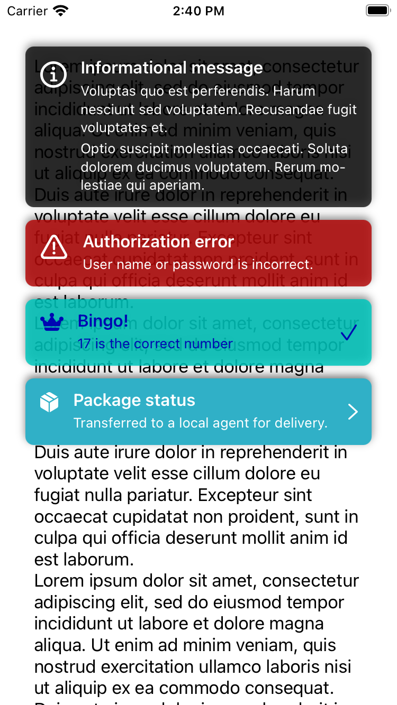
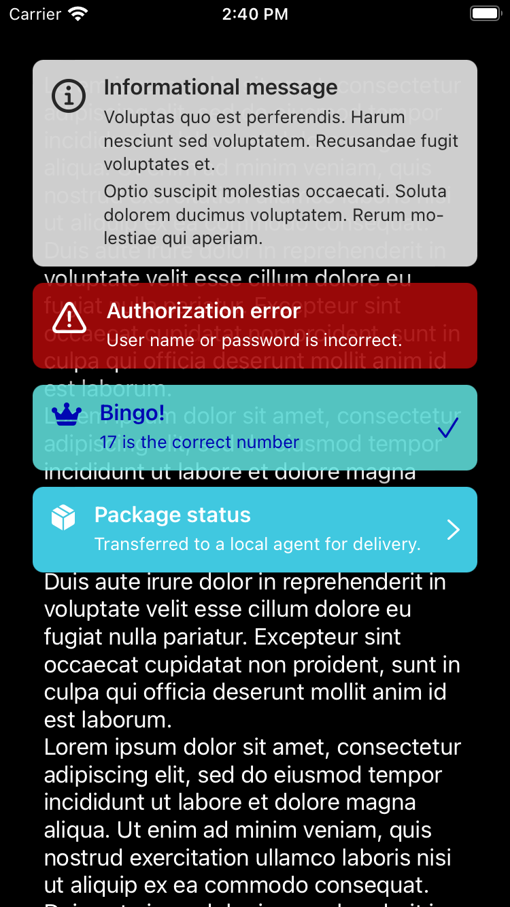

# Toast

iOS application-wide user notification system.

## Overview

`Toast` designed to have minimalistic API and no impact on existing interface. It shows its messages in its own `UIWindow` that is dismissed once last message is dismissed.

When user touches message, contents of that message will be copied to clipboard and message will be dismissed. When user touches outside of any shown message, all visible messages will be dismissed and touch will be propagated further down to your app's interface. 

Messages can be shown from any thread. `Toast` simply dispatches all calls to main thread asynchronously.

Right-to-left languages are fully supported.

| Light | Dark |
| ---- | ---- |
|||

### Preparations

No launch-time setup is required. Showing, dismissing and arranging on-screen messages is fully automatic.

### Usage

For most common cases you can use two predefined functions. One for successful events:

```swift
Toast.info(
    title: "Request accepted",
    text: "We will contact you within a day."
)
```

And one for failure:

```swift
Toast.error(
    title: "Authorization error",
    text: "User name or password is incorrect."
)
```

To show a message with custom colors use:

```swift
Toast.show(
    title: "Package status",
    text: "Transferred to a local agent for delivery.",
    foreground: .white,
    background: .systemTeal,
    touched: .white,
    icon: UIImage(systemName: "shippingbox.fill"),
    accessory: UIImage(systemName: "chevron.forward"),
    timeout: 6,
    tap: {
        // show status page
    }
)
```

### Customizing

`Toast` stores its defaults in ``Toast/Toast/Config`` structure. You can adjust it just like so:

```swift
Toast.Config.textFont = .preferredFont(forTextStyle: .callout)
Toast.Config.cornerRadius = 16
Toast.Config.shadowOpacity = 0.15

Toast.Config.info.icon = UIImage(systemName: "info.circle.fill", withConfiguration: UIImage.SymbolConfiguration(pointSize: 32))
Toast.Config.info.timeout = 6

Toast.Config.error.icon = UIImage(systemName: "exclamationmark.triangle.fill", withConfiguration: UIImage.SymbolConfiguration(pointSize: 32))
```

## Author

Денис Либит, bteapot@me.com

## License

Toast is available under the MIT license. See the LICENSE file for more info.


